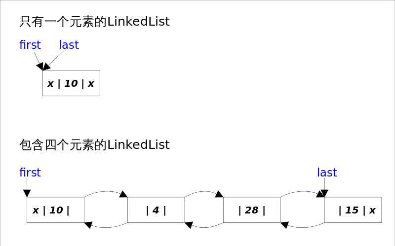
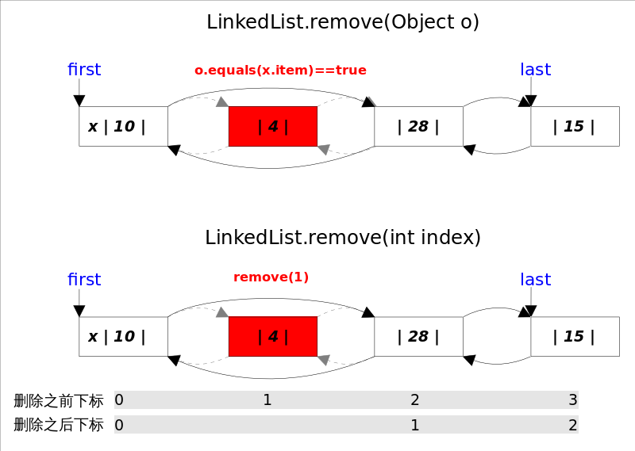

# LinkedList

# 总体介绍

*LinkedList*同时实现了*List*接口和*Deque*接口，也就是说它既可以看作一个顺序容器，又可以看作一个队列（*Queue*），同时又可以看作一个栈（*Stack*）。这样看来，*LinkedList*简直就是个全能冠军。当你需要使用栈或者队列时，可以考虑使用*LinkedList*，一方面是因为Java官方已经声明不建议使用*Stack*类，更遗憾的是，Java里根本没有一个叫做*Queue*的类（它是个接口名字）。关于栈或队列，现在的首选是*ArrayDeque*，它有着比*LinkedList*（当作栈或队列使用时）有着更好的性能。



*LinkedList*底层**通过双向链表实现**，本节将着重讲解插入和删除元素时双向链表的维护过程，也即是之间解跟*List*接口相关的函数，而将*Queue*和*Stack*以及*Deque*相关的知识放在下一节讲。双向链表的每个节点用内部类*Node*表示。*LinkedList*通过`first`和`last`引用分别指向链表的第一个和最后一个元素。注意这里没有所谓的哑元，当链表为空的时候`first`和`last`都指向`null`。

```Java
//Node内部类
private static class Node<E> {
    E item;
    Node<E> next;
    Node<E> prev;
    Node(Node<E> prev, E element, Node<E> next) {
        this.item = element;
        this.next = next;
        this.prev = prev;
    }
}
```

*LinkedList*的实现方式决定了所有跟下标相关的操作都是线性时间，而在首段或者末尾删除元素只需要常数时间。为追求效率*LinkedList*没有实现同步（synchronized），如果需要多个线程并发访问，可以先采用`Collections.synchronizedList()`方法对其进行包装。

# 方法剖析

## add()

*add()*方法有两个版本，一个是`add(E e)`，该方法在*LinkedList*的末尾插入元素，因为有`last`指向链表末尾，在末尾插入元素的花费是常数时间。只需要简单修改几个相关引用即可；另一个是`add(int index, E element)`，该方法是在指定下表处插入元素，需要先通过线性查找找到具体位置，然后修改相关引用完成插入操作。


结合上图，可以看出`add(E e)`的逻辑非常简单。
```Java
//add(E e)
public boolean add(E e) {
    final Node<E> l = last;
    final Node<E> newNode = new Node<>(l, e, null);
    last = newNode;
    if (l == null)
        first = newNode;//原来链表为空，这是插入的第一个元素
    else
        l.next = newNode;
    size++;
    return true;
}
```

`add(int index, E element)`的逻辑稍显复杂，可以分成两部，1.先根据index找到要插入的位置；2.修改引用，完成插入操作。

```Java
//add(int index, E element)
public void add(int index, E element) {
	checkPositionIndex(index);//index >= 0 && index <= size;
	if (index == size)//插入位置是末尾，包括列表为空的情况
        add(element);
    else{
    	Node<E> succ = node(index);//1.先根据index找到要插入的位置
        //2.修改引用，完成插入操作。
        final Node<E> pred = succ.prev;
        final Node<E> newNode = new Node<>(pred, e, succ);
        succ.prev = newNode;
        if (pred == null)//插入位置为0
            first = newNode;
        else
            pred.next = newNode;
        size++;
    }
}
```

上面代码中的`node(int index)`函数有一点小小的trick，因为链表双向的，可以从开始往后找，也可以从结尾往前找，具体朝那个方向找取决于条件`index < (size >> 1)`，也即是index是靠近前端还是后端。

## remove()

`remove()`方法也有两个版本，一个是删除跟指定元素相等的第一个元素`remove(Object o)`，另一个是删除指定下标处的元素`remove(int index)`。



两个删除操作都要1.先找到要删除元素的引用，2.修改相关引用，完成删除操作。在寻找被删元素引用的时候`remove(Object o)`调用的是元素的`equals`方法，而`remove(int index)`使用的是下标计数，两种方式都是线性时间复杂度。在步骤2中，两个`revome()`方法都是通过`unlink(Node<E> x)`方法完成的。这里需要考虑删除元素是第一个或者最后一个时的边界情况。

```Java
//unlink(Node<E> x)，删除一个Node
E unlink(Node<E> x) {
    final E element = x.item;
    final Node<E> next = x.next;
    final Node<E> prev = x.prev;
    if (prev == null) {//删除的是第一个元素
        first = next;
    } else {
        prev.next = next;
        x.prev = null;
    }
    if (next == null) {//删除的是最后一个元素
        last = prev;
    } else {
        next.prev = prev;
        x.next = null;
    }
    x.item = null;//let GC work
    size--;
    return element;
}
```

# get()

`get(int index)`得到指定下标处元素的引用，通过调用上文中提到的`node(int index)`方法实现。
```Java
public E get(int index) {
    checkElementIndex(index);//index >= 0 && index < size;
    return node(index).item;
}
```

# set()

`set(int index, E element)`方法将指定下标处的元素修改成指定值，也是先通过`node(int index)`找到对应下表元素的引用，然后修改`Node`中`item`的值。
```Java
public E set(int index, E element) {
    checkElementIndex(index);
    Node<E> x = node(index);
    E oldVal = x.item;
    x.item = element;//替换新值
    return oldVal;
}
```
